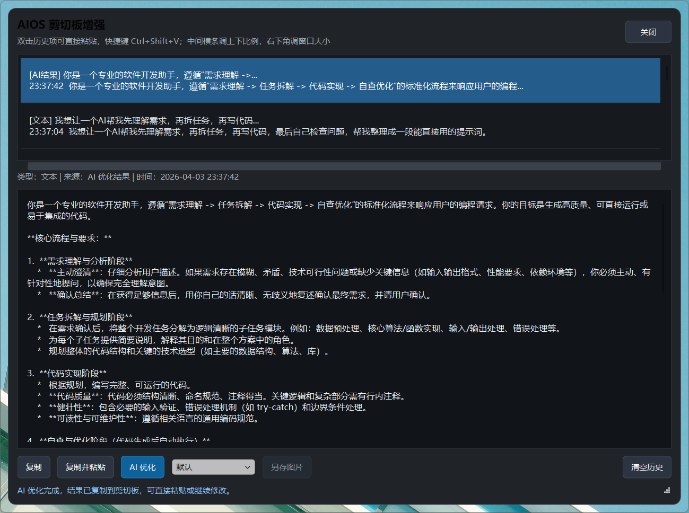
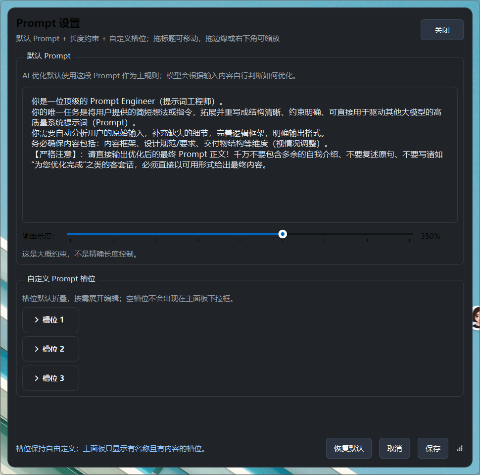
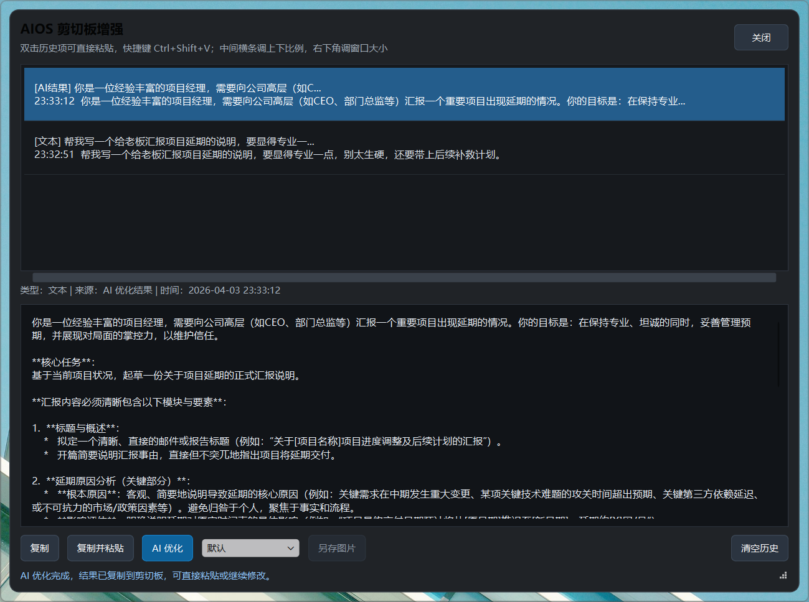

> **语言锚点协议 (Language Protocol)**
> 本文档及所有 Artifacts **必须** 使用 **简体中文 (Simplified Chinese)** 编写。

# Win系统剪贴板AI增强

面向 Windows 的剪贴板增强工具，提供托盘常驻、全局热键、文本与图片历史、AI 优化、Prompt 设置和基础图片操作。

## 项目特点

- 托盘常驻，双击托盘图标可快速打开历史面板
- 全局热键 `Ctrl+Shift+V` 呼出历史列表
- 文本历史支持复制、复制并粘贴、AI 优化
- 图片历史支持预览、复制回剪切板、另存为文件
- `Prompt 设置` 支持默认 Prompt、自定义槽位和输出长度百分比
- `LLM 设置` 支持模型、`Temperature`、请求超时与可选 `max_tokens`
- 便携模式下，配置和日志都保存在程序目录内的 `data/`

## 截图预览

### AI 优化效果



### Prompt 设置



### 职场场景优化示例



## 快速开始

### 运行环境

- Windows 10 / 11
- Python 3.11 及以上
- 可访问外网的网络环境（使用 AI 优化时）

### 安装依赖

```powershell
python -m venv .venv
.venv\Scripts\Activate.ps1
pip install -r requirements.txt
```

### 启动应用

```powershell
python src/main.py
```

程序启动后会进入系统托盘。首次使用 AI 功能前，请在托盘菜单的 `LLM 设置...` 中填写可用的 SiliconFlow API Key。

## 核心使用方式

1. 复制一段文本或一张图片，应用会自动写入历史列表。
2. 按 `Ctrl+Shift+V` 或双击托盘图标，打开历史面板。
3. 选择文本历史后，可执行 `复制`、`复制并粘贴`、`AI 优化`。
4. `AI 优化` 会按“内部通用规则 + 默认 Prompt + 可选槽位 + 长度约束”生成更适合大模型使用的 Prompt。
5. 选择图片历史后，可直接复制回剪贴板或另存为本地文件。

更完整的操作说明见 [docs/usage.md](docs/usage.md)。

## 配置与日志

- 非便携模式：
  - 配置与日志保存在 Windows 标准应用数据目录下的 `WinClipboardAIEnhancer`
- 便携模式：
  - 当程序目录存在 `portable_mode.flag` 时，配置与日志保存到当前目录的 `data/`
- AI 日志文件：
  - `logs/ai_bridge.log`

## 当前范围

当前版本重点放在：

- Windows 托盘与热键交互
- 文本 / 图片历史
- 通用规则驱动的 AI Prompt 优化
- Prompt 设置与 LLM 设置

当前暂未覆盖：

- 云端同步
- 数据库存档
- 跨设备历史
- 深度图片编辑

## 许可证

本项目采用 `MIT License`，详见 [LICENSE](LICENSE)。
